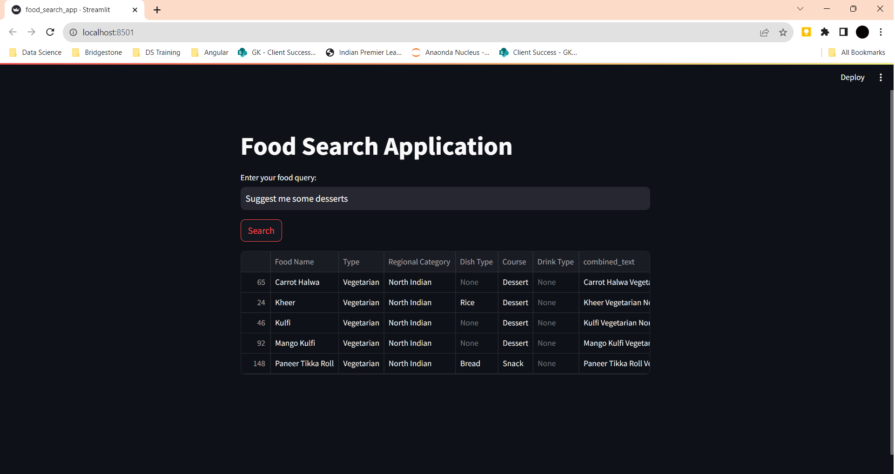

# Food Search Application

## Overview
This repository contains a food search application that uses natural language processing to allow users to search for food items. The application integrates the ChatGPT API, Langchain, and FAISS for efficient and intelligent search capabilities. It also includes a Streamlit frontend for an interactive user experience.

## Features
- Natural language processing for understanding user queries.
- Integration with ChatGPT API for advanced text interpretation.
- FAISS vector database for efficient searching.
- Streamlit frontend for easy user interaction.

## Installation
To run this application, you will need Python installed on your system. Then, you can install the required dependencies via pip:

``` bash
pip install streamlit openai pandas faiss-cpu sentence-transformers
```

Note: Use faiss-gpu instead of faiss-cpu if you're working with a GPU.

## Usage
1. Clone this repository to your local machine.
2. Navigate to the cloned directory.
3. Run the Streamlit application:

``` bash
streamlit run food_search_app.py
```

Open your web browser and go to the localhost URL provided by Streamlit.

## Screenshots

### Search Interface


### Search Results


### Search Results


### Search Results

